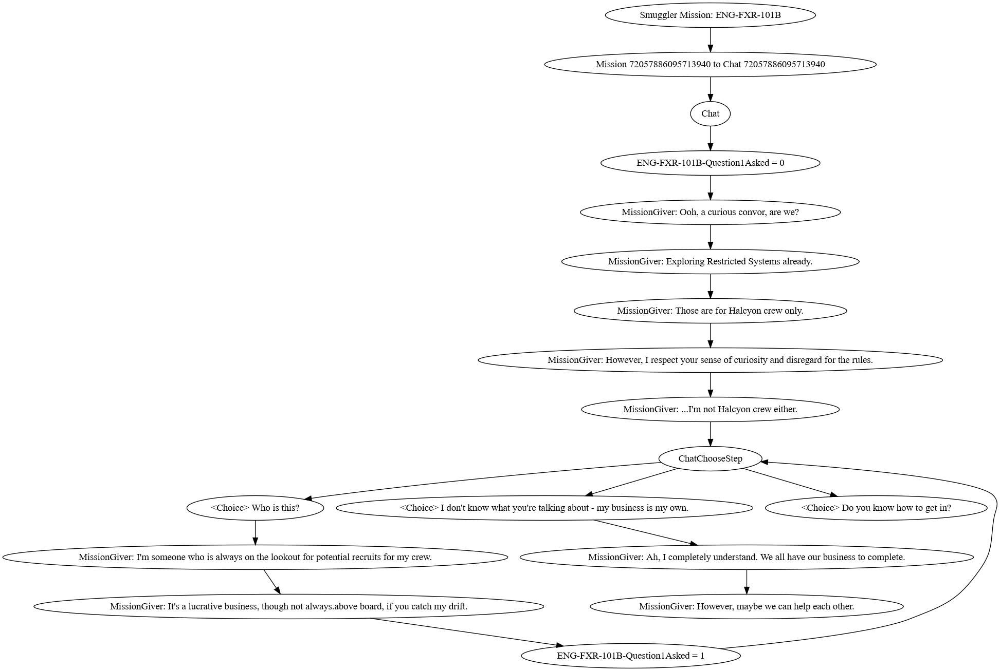

# SwgeDatapadEmulator
Managed package that emulates the Disney PlayAPI backend used by the Play Disney Parks (Android) app to allow the Star Wars Datapad to both run in a browser and accept injected man-in-the-middle state data over a websocket

## `SwgeDatapadEmulator` project

The program requires 3 arguments:

1) The IP address of the network device the WebSocket should operate on
2) The path where `fullchain.pem` and `privkey.pem` can be found, required to run a SSL-enabled WebSocket
3) The operating mode, either `log` or `emulate`

Example: `SwgeDatapadEmulator.exe "192.168.1.8" "C:\Certbot\live\example.com" log`

**Important**: the WebSocket implementation used by the WebView hosting the Datapad can only make secure WebSocket connections. This requires a domain name and valid SSL certificate on the listening server. For simplicity, the entire app has been set up to use and require SSL.

### `emulate`: Emulating the API while running in the browser

Inject the following JavaScript snippit into the Datapad frontend to allow the API commands to be handled over the websocket:

```javascript
const _interopSocket = new WebSocket('wss://YOUR_DOMAIN_NAME.com:7777');

_interopSocket.addEventListener('message', function (message) {
	PlayAPI.handlePromiseReponse(message.data)
});

window.Android = {
	postMessage: function(message) {
		_interopSocket.send(message);
	}
};
```

Finding the webapp data is trivial once the Android application has been unpacked and is left as an exercise to the reader. It's worth noting that the WebView seems to inject a few JS libraries at runtime (outside of the `index.html`) such as `playAPI.js` and the Phaser framework libraries, which can be found in a separate common libraries folder, also left as an exercise to the reader. These will need to be manually included in the index file to run properly in a browser.

### `log`: Datalogging on actual hardware

The app can also be repacked with a slightly different injected script to allow the app running on actual hardware to log all interactions between PlayAPI and the native application (useful for getting sample data at parks, for beacons, etc)

```javascript
const _interopSocket = new WebSocket('wss://YOUR_DOMAIN_NAME.com:7777');
var _isConnected = false;

_interopSocket.addEventListener('open', function (event) {
	_isConnected = true;
    _interopSocket.send(JSON.stringify({
		type: "CONNECT",
		timestamp: new Date().toISOString()
	}))
});

window.addEventListener('error', (event) => {
	if (_isConnected)
		_interopSocket.send(JSON.stringify({
			type: "WINDOW_ERROR",
			timestamp: new Date().toISOString(),
			payload: event
		}))
});

try {
	var original_sendCommand = _PlayAPI._sendCommand;

	_PlayAPI._sendCommand = function(cmdObject) {
		if (_isConnected)
			_interopSocket.send(JSON.stringify({
				type: "COMMAND_JS_TO_NATIVE",
				timestamp: new Date().toISOString(),
				payload: cmdObject
			}))
	
		original_sendCommand.call(_PlayAPI, cmdObject);
	};
	
	var original_handlePromiseReponse = _PlayAPI._handlePromiseReponse;
	
	_PlayAPI._handlePromiseReponse = function(res) {
		var response = _PlayAPI._parseIfNecessary(res);
		if (_isConnected)
			_interopSocket.send(JSON.stringify({
				type: "COMMAND_NATIVE_TO_JS",
				timestamp: new Date().toISOString(),
				payload: response
			}))
	
		original_handlePromiseReponse.call(_PlayAPI, res);
	};
	
	var original_nativeCallback = PlayAPI.nativeCallback;
	
	PlayAPI.nativeCallback = function(res) {
		var response = _PlayAPI._parseIfNecessary(res);
		if (_isConnected)
			_interopSocket.send(JSON.stringify({
				type: "COMMAND_NATIVE_CALLBACK",
				timestamp: new Date().toISOString(),
				payload: response
			}))
	
		original_nativeCallback.call(PlayAPI, res);
	}
}
catch (err) {
	if (_isConnected)
			_interopSocket.send(JSON.stringify({
			type: "INIT_ERROR",
			timestamp: new Date().toISOString(),
			payload: err
		}))
}
```

Output is saved to `out.jsonl` in the working directory.

Example output:

```json lines
{"type":"CONNECT","timestamp":"2022-05-26T23:14:07.317Z"}
{"type":"COMMAND_JS_TO_NATIVE","timestamp":"2022-05-26T23:14:08.441Z","payload":{"reqId":0,"type":"asyncResponse","command":"SHOW_CONTROL_SESSION_INIT"}}
{"type":"COMMAND_JS_TO_NATIVE","timestamp":"2022-05-26T23:14:08.455Z","payload":{"reqId":1,"type":"asyncResponse","command":"SHOW_CONTROL_EFFECT_IN_RANGE","payload":{"event_type":"EVENT_TYPE_SUBSCRIBE","params":{}}}}
{"type":"COMMAND_JS_TO_NATIVE","timestamp":"2022-05-26T23:14:08.459Z","payload":{"reqId":2,"type":"asyncResponse","command":"BEACON_GAME_ADVANCE_IN_RANGE","payload":{"event_type":"EVENT_TYPE_SUBSCRIBE","params":{}}}}
{"type":"COMMAND_JS_TO_NATIVE","timestamp":"2022-05-26T23:14:08.462Z","payload":{"reqId":3,"type":"asyncResponse","command":"SHOW_CONTROL_DATA_RECEIVED","payload":{"event_type":"EVENT_TYPE_SUBSCRIBE","params":{}}}}
{"type":"COMMAND_JS_TO_NATIVE","timestamp":"2022-05-26T23:14:08.471Z","payload":{"reqId":4,"type":"asyncResponse","command":"ACCESSIBILITY_UPDATED","payload":{"event_type":"EVENT_TYPE_SUBSCRIBE","params":{}}}}
{"type":"COMMAND_JS_TO_NATIVE","timestamp":"2022-05-26T23:14:08.477Z","payload":{"reqId":5,"type":"asyncResponse","command":"GAME_BACK","payload":{"event_type":"EVENT_TYPE_SUBSCRIBE","params":{}}}}
{"type":"COMMAND_JS_TO_NATIVE","timestamp":"2022-05-26T23:14:08.499Z","payload":{"reqId":6,"type":"asyncResponse","command":"GET_GAME_CONTENT","payload":{"contentId":"page-counts","contentVersionId":"87"}}}
{"type":"COMMAND_NATIVE_TO_JS","timestamp":"2022-05-26T23:14:08.562Z","payload":{"requestType":"SHOW_CONTROL_SESSION_INIT","payload":true,"requestID":"0","status":"SUCCESS","type":"asyncResponse"}}
{"type":"COMMAND_NATIVE_TO_JS","timestamp":"2022-05-26T23:14:08.567Z","payload":{"requestType":"SHOW_CONTROL_EFFECT_IN_RANGE","payload":true,"requestID":"1","status":"SUCCESS","type":"asyncResponse"}}
{"type":"COMMAND_NATIVE_TO_JS","timestamp":"2022-05-26T23:14:08.570Z","payload":{"requestType":"BEACON_GAME_ADVANCE_IN_RANGE","payload":true,"requestID":"2","status":"SUCCESS","type":"asyncResponse"}}
{"type":"COMMAND_NATIVE_TO_JS","timestamp":"2022-05-26T23:14:08.571Z","payload":{"requestType":"SHOW_CONTROL_DATA_RECEIVED","payload":true,"requestID":"3","status":"SUCCESS","type":"asyncResponse"}}
{"type":"COMMAND_NATIVE_TO_JS","timestamp":"2022-05-26T23:14:08.573Z","payload":{"requestType":"ACCESSIBILITY_UPDATED","payload":true,"requestID":"4","status":"SUCCESS","type":"asyncResponse"}}
{"type":"COMMAND_NATIVE_TO_JS","timestamp":"2022-05-26T23:14:08.574Z","payload":{"requestType":"GAME_BACK","payload":true,"requestID":"5","status":"SUCCESS","type":"asyncResponse"}}
{"type":"COMMAND_NATIVE_TO_JS","timestamp":"2022-05-26T23:14:08.576Z","payload":{"requestType":"GET_GAME_CONTENT","payload":{"data":[{"lang/generated-en":95,"lang/en":12}]},"requestID":"6","status":"SUCCESS","type":"asyncResponse"}}
```

## `SwgeChatbotParser` project

Work-in-progress attempt to emulate the data flow of missions and chat steps to generate a dialogue tree that details all of the possible interactions, items, and installations/beacons/barcodes at Galaxy's Edge and Galactic Starcruiser.


